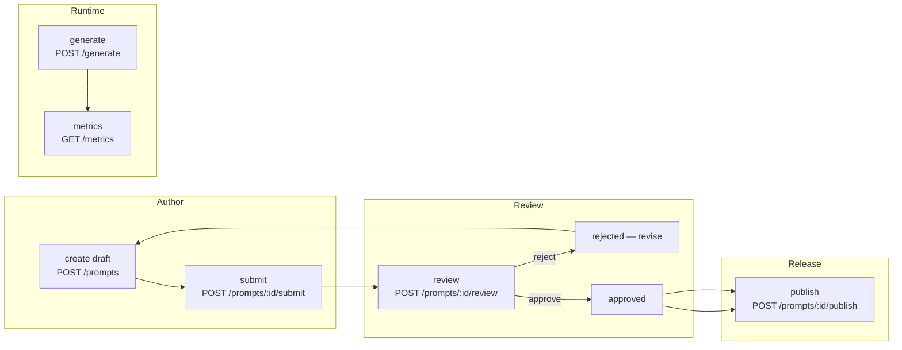

# Request Flow (Prompt Lifecycle) — Diagram

This document shows how a prompt moves through the system and where the key API endpoints interact.

## Text Flow

draft -> in_review -> approved -> published
           |            
           v
        rejected

Key interactions:
- Author creates a draft via `POST /prompts`.
- Author submits for review via `POST /prompts/{id}/submit`.
- Reviewer approves/rejects via `POST /prompts/{id}/review`.
- If approved, the product owner publishes with `POST /prompts/{id}/publish`.
- Evaluations are run via `POST /evaluations` and transition through queued->running->scored.
- Runtime generation uses `POST /generate` which goes through a model adapter.
- Observability is exposed at `GET /metrics` and structured logs.

## Mermaid Diagram

## Short narrative

1. An author creates a draft prompt in the prompt store.
2. The author submits the prompt for review; reviewers inspect and either approve or reject.
3. If rejected, the author revises the draft and resubmits.
4. Once approved, a product owner publishes the prompt, adding a version tag.
5. Evaluations can be created to quantitatively test prompts; results are used by reviewers.
6. At runtime, `POST /generate` calls the adapter; usage is visible via `GET /metrics` and structured logs.

---

File: workflows/request_flow.md
